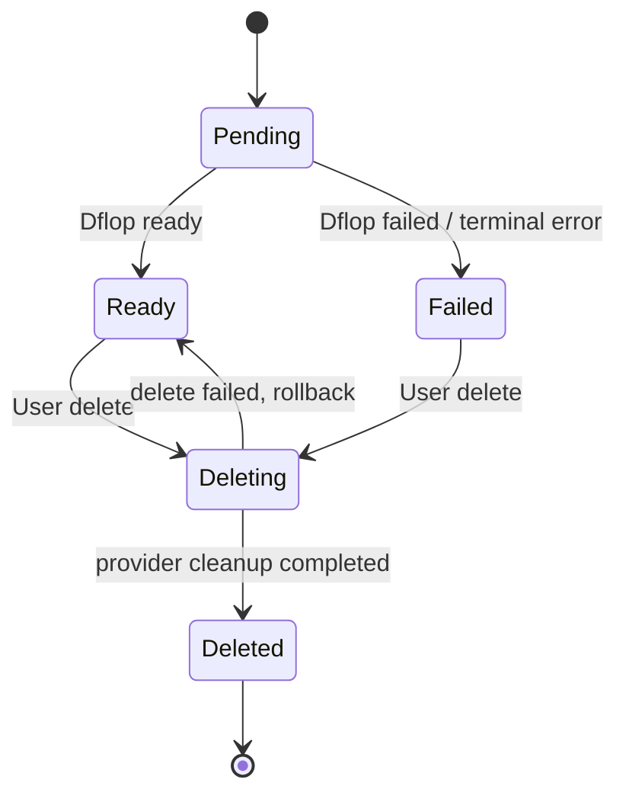
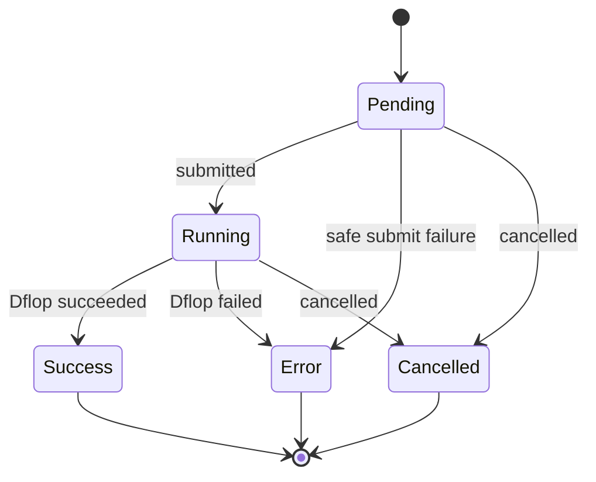

# VOZEB-PRO — 声音克隆 (Voice Cloning) Integration Design v2.0

**Project:** VOZEB-PRO-custom  
**Feature:** 声音克隆 / Voice Cloning  
**Primary provider:** Dflop (`model.dflop.top` / `api.dflop.top`)  
**Design version:** 2.0  
**Updated:** 2026-09-03  
**Status:** Implementation-ready design

---

## 1. Mục tiêu tài liệu

Tài liệu này viết lại phương án tích hợp **声音克隆 (Voice Cloning)** cho VOZEB-PRO dựa trên:

1. source code hiện tại của `VOZEB-PRO-custom`;
2. tài liệu API chính thức của nhà cung cấp Dflop;
3. kiến trúc Logical Model / Channel Routing / PAYG / Generation Task hiện có của dự án.

Nguồn Dflop tham khảo chính:

- Media APIs: <https://model.dflop.top/docs/reference/media-apis#post-v1-audio-speech>
- Model list: <https://model.dflop.top/docs/reference/models>
- API reference/index: <https://model.dflop.top/docs/reference/api-reference>

Thiết kế này **không gọi MiniMax trực tiếp**. Dflop được xem là provider contract của MVP.

---

# 2. Kết luận kiến trúc

Phương án được chọn:

> **Voice Profile là tài nguyên của VOZEB-PRO; Dflop Voice ID chỉ là binding upstream.**  
> Clone sử dụng Dflop `/v1/audio/voices`; TTS sử dụng Dflop `/v1/audio/speech` với model `voice-tts-pro` và truyền cloned voice ID vào trường `voice`.

Các quyết định chính:

1. Thêm domain **Voice Profile / 我的声音** thuộc user.
2. User upload audio vào storage hiện có của VOZEB-PRO.
3. Backend chuyển asset thành một URL Dflop có thể truy cập rồi gọi clone.
4. Clone luôn dùng **async mode**.
5. VOZEB-PRO lưu Dflop voice ID nội bộ; frontend chỉ dùng `voiceProfileId`.
6. TTS cloned voice vẫn đi qua `/api/audio-tasks`, không tạo một TTS pipeline thứ hai.
7. Khi dùng cloned voice, routing phải **pin vào channel/provider account đã tạo voice đó**; không được fallback sang channel không có voice.
8. Dflop preset voices được lấy từ `GET /v1/audio/voices`; không nên hard-code danh sách OpenAI `alloy`, `nova` cho model `voice-tts-pro`.
9. Clone dùng pricing engine hiện tại với `capability=audio` + `request=1`.
10. TTS dùng pricing engine hiện tại với `capability=audio` + `characters`.
11. Tất cả request có tính phí phải có `Idempotency-Key` ổn định.
12. Không hard-code giá Dflop vào business logic; giá phải quản lý qua model pricing/rate card của VOZEB-PRO.

---

# 3. Những điểm chính xác từ tài liệu Dflop

## 3.1 TTS

Dflop cung cấp:

```text
POST /v1/audio/speech
```

Model được tài liệu hiện tại công bố:

```text
voice-tts-pro
```

Request contract:

```json
{
  "model": "voice-tts-pro",
  "input": "你好，欢迎使用语音合成。",
  "voice": "<preset voice id hoặc cloned voice id>",
  "speed": 1.0,
  "async": true
}
```

Quy tắc quan trọng:

- `input` tối đa **5000 ký tự**;
- output là **MP3**;
- `voice` có thể là:
  - preset voice ID của Dflop;
  - cloned voice ID trả về từ `/v1/audio/voices`;
- `speed` theo tài liệu hiện tại **chỉ có hiệu lực với cloned voice**;
- Dflop khuyến nghị dùng async cho văn bản dài;
- async TTS có trạng thái:
  - `pending`
  - `succeeded`
  - `failed`;
- khi thành công trả `audio_url` và có thể có `duration_sec`;
- lỗi async được Dflop hoàn tiền upstream;
- Dflop ghi `audio_url` là public URL lâu dài/permanent trên object storage của họ.

VOZEB-PRO vẫn nên tải audio kết quả về storage của mình để đảm bảo ownership, media lifecycle, audit và không phụ thuộc URL upstream.

---

## 3.2 Voice cloning

API chi tiết của Dflop công bố:

```text
POST   /v1/audio/voices
GET    /v1/audio/voices
GET    /v1/audio/voices/{id}
DELETE /v1/audio/voices/{id}
```

Clone request:

```json
{
  "name": "女主角 01",
  "audio_url": "https://...",
  "async": true
}
```

Yêu cầu sample được Dflop mô tả:

- URL audio phải là URL công khai/upstream có thể tải được;
- thời lượng: **5 giây – 3 phút**;
- nên là **giọng người rõ ràng**.

Dflop không yêu cầu client upload file bytes trực tiếp vào endpoint clone; VOZEB-PRO phải cung cấp `audio_url`.

Async clone:

```json
{
  "id": "...",
  "status": "pending"
}
```

Sau đó poll:

```text
GET /v1/audio/voices/{id}
```

State contract:

```text
pending -> ready
        -> failed
```

Dflop khuyến nghị tích hợp mới dùng async vì synchronous clone có thể kéo dài hàng chục giây đến vài phút và chịu giới hạn CDN khoảng 100 giây.

Cloned `id` sau khi `ready` được dùng trực tiếp trong:

```json
{
  "model": "voice-tts-pro",
  "voice": "<cloned id>"
}
```

Dflop cũng cho phép cloned voice sử dụng cho `dh-avatar`.

---

## 3.3 Preset voices

```text
GET /v1/audio/voices
```

trả cả:

```json
{
  "voices": [],
  "presets": [
    {
      "id": "...",
      "name": "..."
    }
  ]
}
```

Do đó với Dflop `voice-tts-pro`, frontend nên sử dụng danh sách preset từ provider/cache thay vì dùng cứng `audioVoiceOptions` hiện tại của OpenAI.

---

## 3.4 Idempotency

Dflop hỗ trợ:

```http
Idempotency-Key: <1-200 printable ASCII chars>
```

cho các POST có tính phí, bao gồm voice clone và TTS.

Đặc tính quan trọng:

- cùng key + cùng body -> replay response cũ, không charge lần hai;
- cùng key + body khác -> `409 idempotency_key_reuse`;
- request cùng key đang chạy -> `409 idempotency_in_flight`;
- retention hiện tại: **7 ngày**;
- scope là **Dflop account**, không phải riêng API key.

VOZEB-PRO phải tận dụng cơ chế này, không chỉ dựa vào idempotency nội bộ.

---

## 3.5 Billing Dflop

Tài liệu hiện tại hiển thị hai SKU:

```text
voice-clone-pro  -> clone voice, tính theo mỗi voice
voice-tts-pro    -> TTS, tính theo ký tự
```

Trang model list tại thời điểm tài liệu này được viết hiển thị xấp xỉ:

```text
voice-clone-pro : 40.44 / voice
voice-tts-pro   : 0.1254 / character
```

Trong media API, TTS cũng được mô tả tương đương khoảng `125.36 / 1000 characters`.

Vì provider nói model/price có thể thay đổi và có public catalog realtime, **không được hard-code các con số trên vào source code VOZEB-PRO**.

Các con số chỉ dùng làm thông tin tham khảo khi cấu hình giá ban đầu.

---

## 3.6 Điểm không thống nhất trong tài liệu Dflop

Có một khác biệt giữa hai trang tài liệu hiện tại:

- Media API chi tiết + API reference index dùng:

```text
POST /v1/audio/voices
```

- Model list ghi endpoint cho SKU `voice-clone-pro` là:

```text
POST /v1/audio/voice-clone
```

Thiết kế này chọn:

```text
/v1/audio/voices
```

làm **canonical endpoint**, vì đây là endpoint được mô tả đầy đủ cùng GET/list/status/delete và cũng xuất hiện trong API index.

Tuy nhiên đường dẫn phải đặt trong channel/model `advancedConfig.createPath`, không hard-code duy nhất trong runtime. Nhờ vậy có thể đổi sang alias khác mà không sửa business code.

---

# 4. Đánh giá source VOZEB-PRO hiện tại

## 4.1 Thành phần có thể tái sử dụng

### Audio task API

```text
web/src/app/api/audio-tasks/route.ts
```

Đã có:

- auth;
- rate limit;
- generation concurrency;
- logical model resolution;
- candidate channel routing;
- capability constraints;
- `clientRequestId` idempotency nội bộ;
- generation scheduler/recovery.

### Audio runtime

```text
web/src/lib/server/audio-task-runtime.ts
```

Đã có:

- provider request;
- `Idempotency-Key`;
- async task ID handling;
- polling;
- candidate fallback;
- billing/refund;
- fetch audio result;
- persist result vào VOZEB storage;
- generation attempt logging.

Runtime hiện đã có default create path:

```text
/audio/speech
```

và có thể dùng `advancedConfig.createPath` / `queryPath`.

### Audio task config

```text
web/src/lib/server/audio-task-store.ts
```

Đã hỗ trợ:

```ts
voice?: string;
format?: string;
speed?: string;
```

### Pricing

```text
web/src/lib/billing/pricing.ts
```

Đã có:

```ts
BillableCapability = "text" | "image" | "video" | "audio"
```

và dimension:

```text
request
characters
...
```

Do đó không cần thêm capability `voice_clone` vào pricing core.

### System AI proxy

```text
web/src/app/api/ai/system/[channelId]/[...path]/route.ts
```

Đã có:

- proxy theo system channel;
- provider auth;
- idempotency forwarding;
- model pricing;
- reserve/final charge;
- provider attempt/audit;
- `/audio/speech` đã được classify là `audio`.

### Reference assets

```text
web/src/app/api/reference-assets/route.ts
web/src/lib/server/reference-asset-store.ts
web/src/lib/server/reference-asset-access.ts
```

Đã hỗ trợ audio upload, persistent media và provider-readable signed URL.

---

# 5. Những khoảng trống cần bổ sung

Hiện tại dự án chưa có:

1. Voice Profile entity thuộc user.
2. Voice Clone task/runtime.
3. API quản lý cloned voices.
4. Mapping `voiceProfileId -> Dflop voice id`.
5. Quy tắc pin routing cloned voice vào đúng channel/provider account.
6. Dynamic Dflop preset voice list.
7. `/audio/voices` billing classification trong system proxy.
8. UI `我的声音`.
9. Voice selector phân biệt preset và cloned voice.
10. Validation 5s–180s cho clone source.
11. Consent/audit cho voice owner authorization.

---

# 6. Kiến trúc tổng thể

```text
┌───────────────────────────────┐
│            Frontend           │
│                               │
│ Create / Canvas / AI短剧      │
│ VoiceSelector / 我的声音       │
└──────────────┬────────────────┘
               │ voiceProfileId
               ▼
┌───────────────────────────────┐
│        VOZEB-PRO API          │
│                               │
│ /api/voice-profiles           │
│ /api/voice-profiles/:id       │
│ /api/audio-tasks              │
└──────────┬─────────┬──────────┘
           │         │
           │         └───────────────┐
           ▼                         ▼
┌────────────────────┐    ┌────────────────────────┐
│ Voice Clone Runtime│    │ Existing Audio Runtime │
│                    │    │                        │
│ upload URL         │    │ voiceProfile resolve   │
│ clone submit       │    │ TTS async submit       │
│ clone poll         │    │ TTS poll               │
└──────────┬─────────┘    └───────────┬────────────┘
           │                          │
           ▼                          ▼
┌───────────────────────────────────────────────┐
│      Existing Logical Model / Channel         │
│      Routing + System AI Proxy + Billing      │
└───────────────────────┬───────────────────────┘
                        │
                        ▼
┌───────────────────────────────────────────────┐
│                    Dflop                      │
│                                               │
│ POST /v1/audio/voices                         │
│ GET  /v1/audio/voices/{id}                    │
│ POST /v1/audio/speech                         │
│ GET  /v1/audio/speech/{id}                    │
└───────────────────────────────────────────────┘
```

---

# 7. Domain model

## 7.1 Voice Profile

Voice Profile là entity user-facing.

Frontend không được biết hoặc lưu trực tiếp Dflop `voice id` làm identity chính.

Ví dụ:

```text
VoiceProfile
  id                 = vp_xxx
  userId             = user_xxx
  name               = 女主角
  status             = ready
  sourceStorageKey   = permanent/.../audio/...mp3
  provider           = dflop
  providerChannelId  = channel_xxx
  providerVoiceId    = upstream_xxx
```

Lợi ích:

- không leak provider implementation vào UI;
- rename voice không ảnh hưởng upstream ID;
- sau này đổi provider dễ hơn;
- có thể quản lý consent/lifecycle/audit;
- có thể pin routing an toàn.

---

# 8. Database design

## 8.1 Bảng `voice_profiles`

MVP chỉ cần một bảng vì Dflop là provider chính và một cloned voice phải pin vào một system channel.

```sql
CREATE TABLE IF NOT EXISTS voice_profiles (
    id text PRIMARY KEY,
    user_id text NOT NULL REFERENCES users(id) ON DELETE CASCADE,

    name text NOT NULL,
    status text NOT NULL DEFAULT 'pending',

    source_storage_key text NOT NULL,
    source_mime_type text,
    source_duration_ms integer,

    provider text NOT NULL DEFAULT 'dflop',
    provider_channel_id text NOT NULL,
    provider_voice_id text,
    upstream_status text,
    upstream_trace_id text,

    preview_storage_key text,

    consent_version text NOT NULL,
    consent_confirmed_at timestamptz NOT NULL,

    error_code text,
    error_message text,

    last_used_at timestamptz,
    created_at timestamptz NOT NULL DEFAULT now(),
    updated_at timestamptz NOT NULL DEFAULT now(),

    CONSTRAINT voice_profiles_status_check CHECK (
        status IN ('pending', 'ready', 'failed', 'deleting', 'deleted')
    )
);

CREATE INDEX IF NOT EXISTS voice_profiles_user_created_idx
ON voice_profiles(user_id, created_at DESC);

CREATE INDEX IF NOT EXISTS voice_profiles_provider_voice_idx
ON voice_profiles(provider, provider_channel_id, provider_voice_id);
```

### Không FK `provider_channel_id`

System channels hiện được quản lý trong settings/config thay vì một relational table cố định, vì vậy MVP không bắt buộc FK.

---

## 8.2 Có cần `voice_provider_bindings` không?

**MVP: chưa cần.**

Một bảng riêng chỉ cần khi muốn:

- clone cùng một Voice Profile sang nhiều provider;
- clone cùng voice trên nhiều Dflop account;
- replicate voice giữa nhiều routing channel.

V2 có thể tách:

```text
voice_profiles
voice_provider_bindings
```

nhưng không nên tăng độ phức tạp ngay từ MVP.

---

# 9. Upstream channel ownership

Đây là quy tắc quan trọng nhất của cloned voice.

Dflop mô tả voice list theo **account**. Các API key thuộc cùng account chia sẻ wallet; cloned voice cũng được truy vấn qua account voice library.

VOZEB-PRO không có metadata đáng tin cậy để chứng minh hai channel API key thuộc cùng một Dflop account.

Vì vậy MVP áp dụng quy tắc an toàn:

> **Voice clone được pin vào `provider_channel_id` đã tạo nó.**

Khi user chọn cloned voice:

```text
voiceProfile.providerChannelId == candidate.channelId
```

mới được phép route.

Không được:

```text
channel A clone voice
       ↓
channel A lỗi
       ↓
fallback channel B với cùng voice id
```

vì channel B có thể thuộc account khác và không biết voice ID đó.

Nếu channel clone bị disabled:

- không fallback âm thầm;
- trả lỗi rõ:

```text
该克隆音色所属语音渠道当前不可用
```

---

# 10. Clone flow

## 10.1 Flow user

```text
上传样本
  ↓
校验
  ↓
保存到 VOZEB persistent storage
  ↓
确认声音授权
  ↓
创建 VoiceProfile(status=pending)
  ↓
预留积分
  ↓
POST Dflop /v1/audio/voices async=true
  ↓
保存 upstream voice id
  ↓
poll GET /v1/audio/voices/{id}
  ├─ ready  -> VoiceProfile ready + settle charge
  └─ failed -> VoiceProfile failed + refund/release
```

---

## 10.2 Upload validation

### Backend bắt buộc kiểm tra

```text
5s <= duration <= 180s
```

và phải là audio hợp lệ.

Dflop chỉ công bố yêu cầu URL + thời lượng + clear human voice; tài liệu hiện tại không nêu một danh sách MIME/file format cụ thể cho clone endpoint.

VOZEB-PRO không nên tự tuyên bố rằng Dflop chỉ hỗ trợ WAV/MP3 nếu provider chưa ghi vậy.

### Khuyến nghị chuẩn hóa nội bộ

Để giảm lỗi codec upstream, có thể normalize sample thành:

```text
MP3
mono hoặc stereo bình thường
sample rate phổ biến
```

nhưng đây là implementation hardening, không phải yêu cầu contract Dflop.

---

# 11. Public audio URL cho Dflop

Dflop clone nhận:

```json
{
  "audio_url": "https://..."
}
```

nên Dflop phải truy cập được sample từ Internet.

Source hiện tại đã có:

```text
POST /api/reference-assets
```

trả:

```json
{
  "url": "/api/reference-assets/...",
  "upstreamUrl": "https://...signed..."
}
```

## 11.1 Quy tắc

Voice clone runtime phải dùng:

```text
upstreamUrl
```

không dùng browser-relative URL.

## 11.2 TTL

Signed provider-read URL hiện tại của local reference asset có TTL khoảng **15 phút**.

Đây có thể đủ nếu Dflop fetch source ngay lúc submit, nhưng clone là async và thời gian xử lý có thể kéo dài vài phút.

Khuyến nghị production:

1. ưu tiên object storage pre-signed URL có TTL tối thiểu 1 giờ; hoặc
2. thêm helper chuyên dụng `createProviderReadUrl(..., ttl)` cho voice clone;
3. không tạo public bucket vĩnh viễn chỉ để clone.

URL chỉ cần tồn tại đủ lâu để upstream tải sample, không cần biến source voice thành file public vĩnh viễn.

---

# 12. API nội bộ VOZEB-PRO

## 12.1 Create voice profile

```text
POST /api/voice-profiles
```

Request:

```json
{
  "name": "女主角 01",
  "sourceAssetToken": "permanent/2026/.../audio/xxx.mp3",
  "clientRequestId": "uuid",
  "consentConfirmed": true
}
```

Frontend **không gửi Dflop channel ID** nếu user không ở admin mode.

Backend tự resolve logical clone model/channel.

Response:

```json
{
  "voice": {
    "id": "vp_xxx",
    "name": "女主角 01",
    "status": "pending"
  }
}
```

---

## 12.2 List voices

```text
GET /api/voice-profiles
```

Response:

```json
{
  "voices": [
    {
      "id": "vp_xxx",
      "name": "女主角 01",
      "status": "ready",
      "previewUrl": "/api/reference-assets/...",
      "createdAt": "..."
    }
  ]
}
```

Không trả:

```text
provider api key
providerVoiceId
provider raw error details có secret
```

---

## 12.3 Get one

```text
GET /api/voice-profiles/{id}
```

Dùng cho polling UI.

---

## 12.4 Rename

```text
PATCH /api/voice-profiles/{id}
```

```json
{
  "name": "老板声音"
}
```

MVP rename chỉ đổi tên local VOZEB-PRO; không cần rename provider object nếu Dflop không có endpoint rename riêng.

---

## 12.5 Delete

```text
DELETE /api/voice-profiles/{id}
```

Flow:

```text
ready/failed
  ↓
deleting
  ↓
DELETE Dflop /v1/audio/voices/{providerVoiceId}
  ↓
mark deleted
```

Dflop mô tả DELETE là xóa local voice record phía provider.

Không hard-delete DB ngay; nên giữ tombstone/audit tối thiểu theo retention policy của VOZEB-PRO.

---

## 12.6 Presets

```text
GET /api/audio-voices/presets?model=<logicalModelId>
```

Backend:

1. resolve TTS logical model;
2. chọn Dflop channel;
3. gọi/cache `GET /v1/audio/voices`;
4. chỉ trả `presets` public cho frontend.

Response:

```json
{
  "presets": [
    {
      "id": "preset_xxx",
      "name": "..."
    }
  ]
}
```

Cache đề xuất:

```text
5–30 phút
```

Preset list không cần request lại cho mỗi lần mở Select.

---

# 13. Voice clone runtime

Không tái sử dụng `AudioTask` trực tiếp vì output clone là **voice resource**, không phải audio media.

Tạo runtime riêng:

```text
web/src/lib/server/voice-clone-task-store.ts
web/src/lib/server/voice-clone-task-runtime.ts
```

Task type có thể là:

```ts
type VoiceCloneTask = {
  id: string;
  userId: string;
  voiceProfileId: string;
  status: "pending" | "running" | "success" | "error" | "cancelled";
  config: VoiceCloneTaskConfig;
  upstream?: {
    id: string;
    createPath: string;
  };
  billing?: {
    pointsCost: number;
    pointsRecordId?: string;
    refunded: boolean;
  };
  attempts?: GenerationAttempt[];
  error?: string;
};
```

Task vẫn phải dùng các nền tảng có sẵn:

- generation task store;
- scheduler;
- recovery;
- attempts;
- system AI proxy;
- billing headers;
- idempotency.

---

# 14. Dflop clone request mapping

Canonical VOZEB config:

```ts
{
  name,
  sourceUrl,
  async: true
}
```

Provider request:

```json
{
  "name": "女主角 01",
  "audio_url": "https://vozeb.../provider-read...",
  "async": true
}
```

Endpoint:

```text
/audio/voices
```

Không gửi:

```text
model
format
voice
speed
```

trừ khi Dflop documentation sau này thay đổi.

---

# 15. Clone polling

Submit success:

```json
{
  "id": "dflop_voice_id",
  "status": "pending"
}
```

VOZEB lưu ngay:

```text
voice_profiles.provider_voice_id
voice_clone_task.upstream.id
```

Poll:

```text
GET /audio/voices/{id}
```

Mapping:

| Dflop | VOZEB task | Voice Profile |
|---|---|---|
| `pending` | `running` | `pending` |
| `ready` | `success` | `ready` |
| `failed` | `error` | `failed` |

Polling interval đề xuất:

```text
2–5s ban đầu
sau đó backoff nhẹ
```

Không poll quá nhanh vì Dflop account có thể có request/concurrency limits.

---

# 16. TTS integration

## 16.1 Không thêm endpoint TTS mới

Tiếp tục dùng:

```text
POST /api/audio-tasks
```

Canonical request phía VOZEB nên đổi từ `voice` string thuần sang union rõ ràng.

### Preset

```json
{
  "prompt": "你好",
  "config": {
    "model": "voice-tts",
    "voiceSelection": {
      "type": "preset",
      "voiceId": "preset_xxx"
    }
  }
}
```

### Clone

```json
{
  "prompt": "你好",
  "config": {
    "model": "voice-tts",
    "voiceSelection": {
      "type": "profile",
      "voiceProfileId": "vp_xxx"
    },
    "speed": "1"
  }
}
```

Để migration ít phá vỡ code, backend có thể tạm thời vẫn hỗ trợ legacy:

```text
config.voice
```

nhưng cloned voice phải dùng `voiceProfileId`, không đưa raw Dflop voice ID từ browser.

---

# 17. Resolve cloned voice trong `/api/audio-tasks`

Flow trước `resolveAudioGenerationCandidates`:

```text
body.config.voiceProfileId ?
    load VoiceProfile owned by user
    require status == ready
    extract providerChannelId + providerVoiceId
:
    preset flow
```

Sau đó:

```text
channels = resolveLogicalModelCandidates(...)
```

Nếu clone:

```text
channels = channels.filter(
  c => c.channelId === voiceProfile.providerChannelId
)
```

và canonical audio config:

```ts
{
  ...channel,
  voice: voiceProfile.providerVoiceId,
  voiceProfileId: voiceProfile.id,
  voiceKind: "cloned"
}
```

Nếu preset:

```ts
{
  ...channel,
  voice: presetVoiceId,
  voiceKind: "preset"
}
```

---

# 18. Sửa `AudioTaskConfig`

Đề xuất mở rộng:

```ts
export type AudioTaskConfig = {
  // existing
  baseUrl: string;
  apiKey: string;
  apiFormat: "openai" | "gemini";
  model: string;
  channelId?: string;
  logicalModel?: string;
  voice?: string;
  format?: string;
  speed?: string;

  // new
  voiceKind?: "preset" | "cloned";
  voiceProfileId?: string;
};
```

`voice` tiếp tục là provider-ready value trong worker task.

`voiceProfileId` dùng cho:

- ownership/audit;
- generation logs;
- UI history;
- last-used tracking;
- tránh expose upstream ID.

---

# 19. Dflop TTS request template

Dflop contract không giống OpenAI Audio Speech hoàn toàn.

Dflop request chỉ cần:

```json
{
  "model": "voice-tts-pro",
  "input": "...",
  "voice": "...",
  "speed": 1.0,
  "async": true
}
```

Trong source hiện tại `audio-task-runtime.ts` tạo defaults gồm:

```text
model
input
prompt
text
voice
response_format
format
speed
instructions
```

Không nên gửi thừa field phụ thuộc OpenAI sang Dflop nếu provider không document.

Có hai cách:

### Phương án A — dùng `requestTemplate` hiện có

Cấu hình binding Dflop `voice-tts-pro` chỉ map:

```text
model
input
voice
speed
async=true
```

**Khuyến nghị MVP.**

### Phương án B — protocol adapter riêng

Thêm `dflop-media` adapter và normalize request.

Chỉ nên làm khi nhiều endpoint Dflop cần custom mapping phức tạp hơn.

---

# 20. Async TTS

Với Dflop `voice-tts-pro`, đề xuất luôn:

```json
{
  "async": true
}
```

Lý do:

- nhất quán với generation task architecture;
- tránh CDN timeout;
- có task ID để recovery;
- dễ audit/refund/retry;
- văn bản dài có thể mất vài phút.

Submit:

```json
{
  "id": "...",
  "model": "voice-tts-pro",
  "status": "pending",
  "characters": 1200,
  "created_at": "..."
}
```

Poll:

```text
GET /audio/speech/{id}
```

Success:

```json
{
  "id": "...",
  "status": "succeeded",
  "characters": 1200,
  "duration_sec": "86.40",
  "audio_url": "https://..."
}
```

Existing `audio-task-runtime.ts` đã có generic:

- ID extraction;
- status polling;
- `audio_url` extraction;
- result persistence.

Do đó phần TTS Dflop chủ yếu là config/request mapping, không cần rewrite runtime.

---

# 21. TTS input validation

Dflop giới hạn:

```text
input <= 5000 characters
```

Trong source hiện tại `/api/audio-tasks` đang cắt:

```ts
prompt.slice(0, 20_000)
```

Điều này không phù hợp Dflop `voice-tts-pro`.

Không nên globally đổi audio limit thành 5000 vì provider khác có thể khác.

Phải đưa limit vào generation parameters/capability profile, ví dụ:

```json
{
  "maxCharacters": 5000
}
```

hoặc channel advanced config.

Validation xảy ra **trước khi reserve billing và trước khi submit upstream**.

UI hiển thị:

```text
1234 / 5000
```

---

# 22. Speed behavior

Dflop hiện ghi `speed` chỉ có hiệu lực đối với cloned voice.

UI behavior:

### Preset Dflop voice

```text
Speed control: disabled/hidden
```

### Cloned voice

```text
Speed control: enabled
```

Không tự đặt range mới nếu Dflop chưa công bố range cụ thể trong contract tham khảo.

`normalizeAudioSpeedValue()` hiện ép `0.25–4`. Nếu đây chỉ là OpenAI/default rule, cần tránh coi nó là Dflop provider truth.

Nên để generation parameter profile quyết định range theo model/provider.

---

# 23. Output format

Dflop documentation hiện mô tả `voice-tts-pro` là:

```text
text -> MP3
```

Request contract không liệt kê `response_format` hoặc `format`.

Do đó với logical model Dflop TTS:

```text
formats = ["mp3"]
```

Frontend không nên cho chọn WAV/Opus/AAC/FLAC khi đang dùng `voice-tts-pro`.

Nếu tương lai Dflop thêm format, cập nhật capability profile/config thay vì sửa component.

---

# 24. Preset voice architecture

Current file:

```text
web/src/lib/audio-generation.ts
```

đang hard-code:

```text
alloy
ash
ballad
coral
...
```

Đây là danh sách phù hợp kiểu OpenAI, không phải universal voice catalog.

Không được thay toàn bộ bằng Dflop presets vì project vẫn có thể hỗ trợ provider khác.

Thiết kế mới:

```text
VoiceSelector
  ├─ provider/model preset voices
  └─ user Voice Profiles
```

Nguồn preset priority:

1. model/channel dynamic catalog nếu có;
2. generation parameter static voices;
3. legacy `audioVoiceOptions` cho model cũ.

---

# 25. Billing design

## 25.1 Voice Clone

Không thêm pricing dimension mới.

Rate card logic:

```json
{
  "version": 1,
  "components": [
    {
      "id": "clone-request",
      "dimension": "request",
      "unitPrice": "<sale credits per clone>"
    }
  ]
}
```

Usage:

```ts
normalizeBillableUsage({
  capability: "audio",
  source: "request",
  request: 1
})
```

Logical model đề xuất:

```text
voice-clone
```

Upstream model/SKU:

```text
voice-clone-pro
```

---

## 25.2 TTS

Rate card:

```json
{
  "version": 1,
  "components": [
    {
      "id": "tts-characters",
      "dimension": "characters",
      "unitPrice": "<sale credits>",
      "per": "1000"
    }
  ]
}
```

Usage request phải đếm Unicode code points của `input` giống billing adapter hiện tại.

Logical model đề xuất:

```text
voice-tts
```

Upstream:

```text
voice-tts-pro
```

---

# 26. System AI proxy modification

Current classifier có:

```ts
if (routePath === "/audio/speech") {
  return { model, amount: 1, usageKind: "audio" };
}
```

Cần hỗ trợ clone path.

Vấn đề: Dflop clone body không chứa `model`:

```json
{
  "name": "...",
  "audio_url": "...",
  "async": true
}
```

Do đó proxy phải lấy model hint từ:

```http
x-vozeb-pro-upstream-model: voice-clone-pro
```

hoặc logical model binding config.

Bổ sung classification cho configured create path `/audio/voices` và capability `audio`.

Không nhất thiết hard-code `/audio/voices` nếu `classifyConfiguredPointsRequest()` có thể resolve qua `advancedConfig.createPath`.

Điều kiện acceptance:

```text
POST system proxy /audio/voices
-> authorize as audio create operation
-> find voice-clone logical model
-> reserve request-based points
-> forward Idempotency-Key
-> settle/refund correctly
```

---

# 27. Idempotency design

## 27.1 Clone

VOZEB key:

```text
voice-clone:<voiceProfileId>:attempt:<n>
```

Ví dụ:

```text
voice-clone:vp_123:attempt:1
```

Cùng một logical attempt phải reuse cùng key.

Không tạo key mới khi:

- HTTP connection bị cắt;
- client retry;
- worker recovery;
- chưa biết upstream đã nhận request hay chưa.

Chỉ tăng attempt khi hệ thống đã xác nhận attempt trước **safe failure** và quyết định tạo request mới.

---

## 27.2 TTS

Existing key:

```text
audio-task:<taskId>:attempt:<n>
```

đã phù hợp với Dflop.

---

# 28. Error handling

## 28.1 Clone

### Validation lỗi local

Không submit, không charge:

```text
sample < 5s
sample > 180s
invalid audio
missing consent
invalid URL
```

### Dflop submit 4xx

Mark safe failure, release reserve.

### Dflop 402

Provider balance insufficient. VOZEB không được chuyển lỗi này thành lỗi “user points insufficient” nếu ví VOZEB của user vẫn đủ.

Admin-facing error:

```text
上游 Dflop 账户余额不足
```

User-facing:

```text
声音服务暂时不可用，请稍后重试
```

### Dflop 429

Respect `Retry-After`, backoff.

### `idempotency_in_flight`

Không tạo key mới. Retry cùng key sau backoff.

### `failed`

VoiceProfile -> `failed`; provider upstream refund; VOZEB release/refund user hold.

---

# 29. Dflop trace/audit

Dflop response có header:

```text
x-gateway-trace
```

Voice clone/TTS runtime nên lưu trace vào attempt metadata.

Ví dụ:

```json
{
  "provider": "dflop",
  "channelId": "...",
  "upstreamTaskId": "...",
  "gatewayTrace": "..."
}
```

Lợi ích:

- đối soát chi phí;
- debug provider;
- gửi support Dflop;
- xác định request bị fail ở gateway hay upstream.

Không trả trace đầy đủ cho client thường nếu không cần.

---

# 30. UI/UX

## 30.1 Trang `我的声音`

Route đề xuất:

```text
/voices
```

Tên:

- 中文: `我的声音`
- English: `My Voices`
- Tiếng Việt: `Giọng của tôi`

Card:

```text
声音名称
状态
试听
创建时间
重命名
删除
```

Status:

```text
克隆中
可用
失败
删除中
```

Không hiển thị Dflop raw ID cho normal user.

---

## 30.2 Clone modal

```text
克隆声音

[声音名称                         ]

[ 上传声音样本 ]
支持 5 秒–3 分钟清晰人声

✓ 我确认已获得该声音所有者授权，并同意用于声音克隆

预计消耗：XX 积分

[取消] [开始克隆]
```

Không thêm các option Dflop chưa support/document như:

```text
language_boost
noise reduction provider param
prompt file
provider voice id
```

Nếu muốn noise reduction, đó phải là preprocessing local riêng, không gắn giả thành Dflop clone parameter.

---

## 30.3 Voice selector

```text
音色

平台音色
  ○ Dflop preset A
  ○ Dflop preset B

我的声音
  ○ 女主角 01
  ○ 老板声音
  + 克隆声音
```

Mỗi Voice Profile chỉ xuất hiện nếu:

```text
status == ready
```

---

# 31. Create / Canvas integration

Các component liên quan hiện có:

```text
web/src/components/audio-settings-panel.tsx
web/src/components/creative-generation-preferences.tsx
web/src/app/(user)/canvas/components/canvas-audio-settings-popover.tsx
```

Thay logic Select hard-code bằng shared:

```text
web/src/components/voice-selector.tsx
```

Props đề xuất:

```ts
type VoiceSelection =
  | { type: "preset"; voiceId: string }
  | { type: "profile"; voiceProfileId: string };
```

Không encode dạng:

```text
clone:provider_voice_id
```

vì sẽ leak provider identity vào frontend state và canvas data.

---

# 32. AI短剧 integration

File hiện có:

```text
web/src/app/(user)/drama/[id]/use-drama-audio-queue.ts
web/src/app/(user)/drama/[id]/drama-shot-audio-mode-editor.tsx
```

Character voice nên lưu:

```json
{
  "voice": {
    "type": "profile",
    "voiceProfileId": "vp_xxx"
  }
}
```

không lưu raw Dflop voice ID.

Flow:

```text
角色
  ↓
voiceProfileId
  ↓
每个 shot 生成台词
  ↓
/api/audio-tasks
  ↓
resolve providerVoiceId server-side
  ↓
Dflop voice-tts-pro
```

Điều này giúp đổi provider/binding sau này mà không sửa toàn bộ drama project data.

---

# 33. Preview voice

Sau khi clone `ready`, UI cần cho `试听`.

Dflop clone endpoint không được tài liệu mô tả là tự trả preview audio.

Do đó preview phải dùng TTS:

```text
POST /api/audio-tasks
```

với một câu ngắn mặc định, ví dụ theo locale.

Preview TTS là một lần TTS có tính phí, vì vậy:

- không tự động tạo nhiều preview;
- UI phải thể hiện rõ nếu preview làm phát sinh phí;
- có thể chỉ generate preview khi user bấm `试听` lần đầu rồi cache trong `preview_storage_key`.

Không gộp clone + preview thành một charge nếu pricing business không quy định như vậy.

---

# 34. Consent & security

Dflop nhấn mạnh cần có authorization của chủ giọng nói trước khi clone real voice.

VOZEB-PRO phải có checkbox bắt buộc.

Lưu:

```text
consent_version
consent_confirmed_at
user_id
voice_profile_id
```

UI text đề xuất:

```text
我确认已获得该声音所有者的授权，并同意将该声音样本用于 AI 声音克隆与语音生成。
```

Không cho tạo clone khi checkbox false.

Admin audit nên thấy:

- owner user;
- created time;
- consent version;
- source asset;
- clone status;
- Dflop channel;
- billing record;
- provider trace.

---

# 35. Privacy của source voice

Source voice là dữ liệu nhạy cảm về danh tính giọng nói.

Yêu cầu:

1. persistent asset phải có owner;
2. browser URL cần auth;
3. provider read URL phải signed và time-limited;
4. không log raw signed URL nếu có thể;
5. không log API key;
6. không expose providerVoiceId cho user ngoài nhu cầu debug admin;
7. delete Voice Profile phải có policy xử lý source file rõ ràng.

Khuyến nghị default:

```text
Delete Voice Profile
-> delete provider voice
-> giữ source asset theo media retention/audit trong khoảng cấu hình
```

Không tự động xóa source nếu asset đang được reference ở nơi khác.

---

# 36. Model configuration

## 36.1 Logical model — clone

Đề xuất:

```text
logical id: voice-clone
capability: audio
```

Binding:

```text
provider/channel: Dflop
upstream model: voice-clone-pro
createPath: /audio/voices
queryPath: /audio/voices/{id}
```

Nếu config system không support `{id}` trong queryPath, dùng generic provider query-path resolver đang có.

Generation pricing:

```text
request-based
```

---

## 36.2 Logical model — TTS

```text
logical id: voice-tts
capability: audio
upstream model: voice-tts-pro
createPath: /audio/speech
queryPath: /audio/speech/{id}
```

Generation parameters:

```text
formats: [mp3]
maxCharacters: 5000
supportsPresetVoices: true
supportsClonedVoices: true
speedAppliesTo: cloned
```

Một số field trên là extension mới nếu config schema hiện tại chưa có.

---

# 37. Generation parameter schema cần mở rộng

Current `LogicalModelGenerationParameters` có:

```text
voices
formats
speedRange
```

Đề xuất bổ sung audio-specific metadata:

```ts
type LogicalModelGenerationParameters = {
  // existing...

  maxCharacters?: number;
  voiceCatalog?: "static" | "provider";
  supportsClonedVoices?: boolean;
  speedAppliesTo?: "all" | "cloned";
};
```

Không bắt buộc đưa provider name `dflop` vào schema này.

---

# 38. Provider endpoint configurability

Do tài liệu Dflop có discrepancy `/audio/voices` vs `/audio/voice-clone`, cấu hình phải cho phép admin sửa endpoint.

Runtime default có thể là:

```text
/audio/voices
```

nhưng ưu tiên:

```text
binding.advancedConfig.createPath
```

Điều này phù hợp với kiến trúc provider-task-config hiện tại.

---

# 39. File/module thay đổi đề xuất

## 39.1 Database/migration

Thêm migration cho:

```text
voice_profiles
```

và các index.

---

## 39.2 Backend — new

```text
web/src/app/api/voice-profiles/route.ts
web/src/app/api/voice-profiles/[id]/route.ts
web/src/app/api/audio-voices/presets/route.ts

web/src/lib/server/voice-profile-store.ts
web/src/lib/server/voice-clone-task-store.ts
web/src/lib/server/voice-clone-task-runtime.ts
```

Nếu generation task scheduler yêu cầu registration explicit, bổ sung task type `voice-clone` hoặc dùng một dedicated worker schedule wrapper.

---

## 39.3 Backend — modify

```text
web/src/app/api/audio-tasks/route.ts
```

- nhận `voiceProfileId`;
- ownership check;
- pin channel;
- map provider voice ID;
- validate max characters.

```text
web/src/lib/server/audio-task-store.ts
```

- thêm `voiceKind`;
- thêm `voiceProfileId`.

```text
web/src/lib/server/audio-task-runtime.ts
```

- Dflop request template/async mapping;
- update `last_used_at` sau TTS success;
- đảm bảo MP3 result.

```text
web/src/app/api/ai/system/[channelId]/[...path]/route.ts
```

- classify configured `/audio/voices` clone call là `audio`;
- hỗ trợ model hint khi body không có `model`.

```text
web/src/lib/server/usage-billing-adapter.ts
```

- clone request dùng `request=1`;
- TTS `characters` lấy từ `input` phải được tính đúng.

Lưu ý: `promptText()` hiện đọc `input`, vì vậy TTS request đã có cơ sở để lấy character count.

---

## 39.4 Frontend — new

```text
web/src/components/voice-selector.tsx
web/src/components/voice-clone-dialog.tsx
web/src/app/(user)/voices/page.tsx
```

Service API:

```text
web/src/services/api/voices.ts
```

---

## 39.5 Frontend — modify

```text
web/src/components/audio-settings-panel.tsx
web/src/components/creative-generation-preferences.tsx
web/src/app/(user)/canvas/components/canvas-audio-settings-popover.tsx
web/src/app/(user)/drama/[id]/use-drama-audio-queue.ts
web/src/app/(user)/drama/[id]/drama-shot-audio-mode-editor.tsx
```

---

# 40. State machines

## 40.1 Voice clone



---

## 40.2 TTS



---

# 41. Billing state

## Clone

```text
Create local VoiceProfile
   ↓
Reserve VOZEB points
   ↓
Submit Dflop
   ↓
ready
   ├─ yes -> final charge
   └─ failed -> release/refund
```

Không final charge chỉ vì submit trả `pending`.

---

# 42. Routing cases

## Case A — preset Dflop voice

```text
voice=providerPresetId
```

Có thể dùng normal candidate routing nếu preset tồn tại trên account/channel tương ứng.

Nếu nhiều Dflop accounts có preset catalogs khác nhau, cần validate per candidate trước submit.

MVP đơn giản nhất:

- preset được fetch từ channel đang selected/resolved;
- request pin channel tương tự provider dynamic preset.

---

## Case B — cloned voice

Bắt buộc pin channel:

```text
voiceProfile.providerChannelId
```

Không candidate fallback sang account khác.

---

## Case C — provider channel lỗi

User thấy:

```text
该音色当前所属语音服务不可用，请稍后重试或重新克隆到其他语音服务。
```

Không tự đổi sang preset voice.

---

# 43. Không nên làm trong MVP

1. Clone trực tiếp từ browser tới Dflop.
2. Cho user nhập raw `voice_id`.
3. Hard-code Dflop API key trong frontend.
4. Gọi MiniMax trực tiếp song song với Dflop.
5. Tự động clone cùng sample sang nhiều provider.
6. Browser realtime recording nếu chưa có stable audio normalization/transcoding.
7. Tự động tạo preview TTS ngay sau clone nếu user chưa biết phát sinh phí.
8. Fallback cloned voice sang preset voice.
9. Dùng OpenAI static voices làm preset list cho Dflop.
10. Hard-code giá 40.44 hoặc 0.1254 trong runtime.

---

# 44. TDD / Test matrix

## 44.1 Voice profile API

| ID | Test | Expected |
|---|---|---|
| VC-001 | unauthenticated create | 401 |
| VC-002 | consent false | 400 |
| VC-003 | sample <5s | 400, no billing |
| VC-004 | sample >180s | 400, no billing |
| VC-005 | valid sample | profile pending |
| VC-006 | duplicate same clientRequestId | same profile/task |
| VC-007 | user reads another user's voice | 404/403 |
| VC-008 | rename own voice | success |
| VC-009 | delete own voice | provider delete + local deleted |

---

## 44.2 Dflop clone runtime

| ID | Test | Expected |
|---|---|---|
| VC-101 | request mapping | `{name,audio_url,async:true}` only |
| VC-102 | canonical endpoint | `/audio/voices` |
| VC-103 | idempotency retry | same key |
| VC-104 | `pending` | poll scheduled |
| VC-105 | `ready` | profile ready + settle |
| VC-106 | `failed` | profile failed + refund |
| VC-107 | 409 in-flight | retry same key |
| VC-108 | 402 upstream | provider-service error, no double charge |
| VC-109 | capture x-gateway-trace | stored in attempt metadata |

---

## 44.3 TTS cloned voice

| ID | Test | Expected |
|---|---|---|
| TTS-201 | ready voice owned by user | accepted |
| TTS-202 | voice belongs to another user | reject |
| TTS-203 | pending voice | reject |
| TTS-204 | failed voice | reject |
| TTS-205 | candidate same channel | accepted |
| TTS-206 | candidate different channel | removed |
| TTS-207 | no matching channel | explicit unavailable error |
| TTS-208 | input 5001 chars | local reject |
| TTS-209 | request uses raw providerVoiceId | internal only |
| TTS-210 | async Dflop success | audio saved to VOZEB storage |
| TTS-211 | Dflop failed | points refunded |
| TTS-212 | cloned speed | sent |
| TTS-213 | Dflop preset speed | hidden/not sent by UI policy |
| TTS-214 | Dflop output format | MP3 only |

---

## 44.4 Billing

| ID | Test | Expected |
|---|---|---|
| BILL-301 | clone estimate | request rate card |
| BILL-302 | clone duplicate idempotency | one charge |
| BILL-303 | clone failed | 0 final charge/refund |
| BILL-304 | TTS 100 chars | characters rate card |
| BILL-305 | long TTS reserve | based on request characters |
| BILL-306 | upstream provider cost absent | VOZEB sale pricing still deterministic |

---

## 44.5 UI

| ID | Test | Expected |
|---|---|---|
| UI-401 | Dflop model selected | Dflop presets shown |
| UI-402 | cloned ready voice | appears under 我的声音 |
| UI-403 | pending clone | not selectable for TTS |
| UI-404 | clone selected | speed control enabled |
| UI-405 | Dflop preset selected | speed hidden/disabled |
| UI-406 | Dflop TTS | format fixed MP3 |
| UI-407 | delete voice used by drama | safe warning/reference handling |

---

# 45. Acceptance criteria

Chức năng được coi là hoàn thành khi:

1. User có thể upload sample 5–180 giây.
2. Backend tạo persistent source asset.
3. User bắt buộc xác nhận authorization/consent.
4. Voice clone được submit Dflop bằng `/v1/audio/voices` async.
5. Request có stable Dflop `Idempotency-Key`.
6. UI xem được trạng thái `克隆中 / 可用 / 失败`.
7. Voice Profile `ready` được chọn ở Create/Canvas/AI短剧.
8. TTS dùng `voice-tts-pro` và Dflop cloned ID server-side.
9. TTS input >5000 chars bị reject trước upstream.
10. Dflop TTS output được xử lý là MP3.
11. Cloned voice không fallback sang Dflop channel/account khác.
12. Clone billing dùng audio/request rate card.
13. TTS billing dùng audio/characters rate card.
14. Failure không double charge.
15. Retry không tạo clone/TTS duplicate.
16. Dflop `x-gateway-trace` được lưu để audit.
17. Normal user không thấy API key/raw provider binding.
18. Dflop presets được lấy qua provider catalog hoặc cache, không dùng cứng OpenAI voices.
19. Voice delete gọi upstream delete và cập nhật local lifecycle.
20. Có test coverage cho ownership, routing, billing, retry và async polling.

---

# 46. MVP → V2

## MVP

```text
Dflop only
file upload
voice library
async clone
async TTS
Dflop presets
Create integration
Canvas integration
AI短剧 integration
PAYG
consent
channel pinning
```

## V2

```text
browser recording
local audio cleanup/transcoding
multi-provider voice binding
voice replication
provider account grouping
voice quality scoring
batch character voice setup
voice sharing/team permissions
admin clone moderation
```

---

# 47. Khác biệt so với thiết kế v1

Bản v1 giả định MiniMax là provider clone trực tiếp. Sau khi đối chiếu Dflop, kiến trúc được sửa như sau:

| V1 | V2 |
|---|---|
| MiniMax adapter | Dflop native media API |
| MiniMax upload/clone contract | Dflop `audio_url` clone contract |
| 10s–5min sample | **Dflop: 5s–3min** |
| provider-generated/custom `voice_id` logic | Dflop trả voice resource `id` |
| clone endpoint provider-specific MiniMax | `/v1/audio/voices` |
| TTS provider adapter MiniMax | `/v1/audio/speech`, `voice-tts-pro` |
| static/preset assumption | Dflop `GET /v1/audio/voices` dynamic presets |
| clone binding multi-provider table immediately | single VoiceProfile + pinned Dflop channel for MVP |
| custom `voice_clone` pricing concept | reuse `audio` + `request` pricing dimension |
| generic output formats | Dflop TTS fixed MP3 according to current docs |
| generic 20k audio prompt | Dflop TTS max 5000 characters |

---

# 48. Quyết định cuối cùng

Đối với VOZEB-PRO hiện tại, cách tích hợp phù hợp nhất là:

```text
Voice Profile
    ↓
Dflop voice-clone-pro
POST /v1/audio/voices
    ↓
providerVoiceId
    ↓
Voice Profile ready
    ↓
Existing AudioTask
    ↓
Dflop voice-tts-pro
POST /v1/audio/speech
voice=<providerVoiceId>
    ↓
Existing polling + billing + media persistence
```

Điểm cần giữ tuyệt đối:

> **Frontend chỉ giữ `voiceProfileId`; raw Dflop voice ID được resolve ở backend.**

và:

> **Cloned voice phải pin vào Dflop channel/account đã tạo nó, không được silent fallback.**

Hai nguyên tắc này giúp chức năng clone tích hợp đúng với kiến trúc VOZEB-PRO hiện tại, tránh lỗi multi-channel và vẫn mở đường cho multi-provider về sau.

---

# 49. References

Dflop documentation consulted on 2026-09-03:

1. Media APIs — audio speech / voice management  
   <https://model.dflop.top/docs/reference/media-apis#post-v1-audio-speech>

2. Model list — `voice-clone-pro`, `voice-tts-pro`  
   <https://model.dflop.top/docs/reference/models>

3. API reference/index  
   <https://model.dflop.top/docs/reference/api-reference>

Provider API/price can change. Before production rollout, configuration and smoke tests should verify the currently callable endpoint/model catalog rather than relying on hard-coded documentation values.
