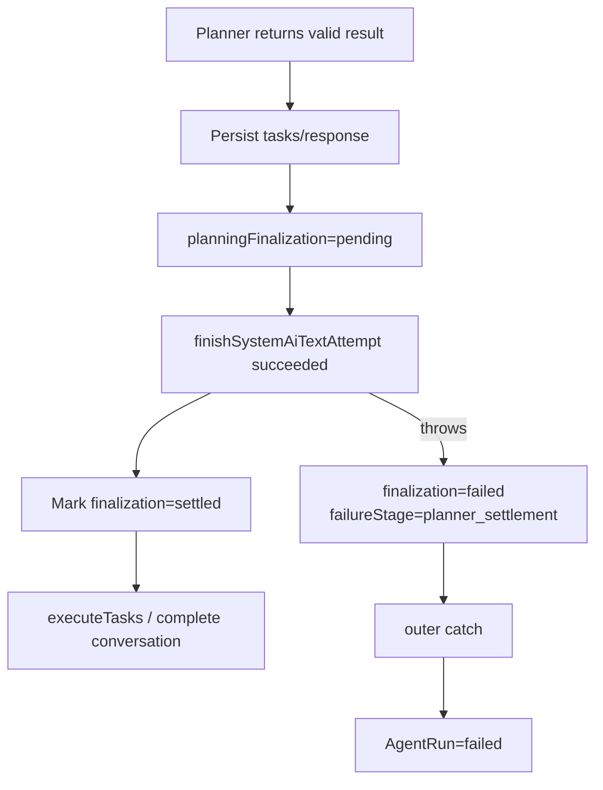
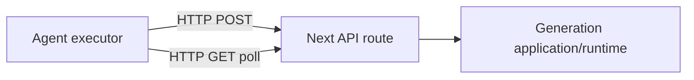

# AGENT_CURRENT_ARCHITECTURE

> Trạng thái: mô tả kiến trúc **hiện tại** của Agent trong snapshot `VOZEB-PRO-custom` được phân tích ngày 2026-09-16.  
> Phạm vi: Agent Run, planner, task orchestration, generation runtime, billing, recovery worker, event/SSE và provider proxy.  
> Mục tiêu: làm baseline trước khi refactor. Tài liệu này **không phải target architecture**.

## 1. Tóm tắt kiến trúc hiện tại

Agent hiện tại được xây như một lớp orchestration phía trên hệ thống generation đã có. Một Agent Run được lưu như một `generation_task` có `task_type='agent'`, trong khi các task con text/image/video/audio tiếp tục được lưu trong cùng hệ thống `generation_tasks`.

```mermaid
flowchart TD
    U[User / Creative UI] --> AR[POST /api/agent/runs]
    AR --> DB[(generation_tasks\ntask_type=agent\npayload=AgentRun JSON)]
    AR --> REC[runGenerationTaskRecoveryBatch]
    REC --> EX[executeAgentRun]
    EX --> P[Planner / direct plan]
    P --> PF[Planner usage settlement]
    PF --> DAG[executeTasks]
    DAG --> CT[Agent child task]
    CT --> HTTP[Self HTTP /api/*-tasks]
    HTTP --> GR[Generation Runtime]
    GR --> ROUTE[Logical model + provider routing]
    ROUTE --> UP[Upstream provider]
    UP --> GR
    GR --> ASSET[Persist result / asset / usage]
    ASSET --> CT
    CT --> DB
    DB --> EV[(creative_run_events)]
    EV --> SSE[/api/agent/runs/:id/events]
    SSE --> U

    W[generation-worker] --> REC
```

Kiến trúc hiện tại có nhiều nền tảng tốt để tái sử dụng: generation task có lease, `FOR UPDATE SKIP LOCKED`, recovery polling, idempotency/billing fingerprint, event log bền vững và SSE replay. Vấn đề chính không phải thiếu recovery hoàn toàn, mà là **ranh giới giữa Agent, Billing và Generation còn gắn quá chặt**, khiến lỗi tạm thời tại một boundary có thể bị nâng thành lỗi terminal của toàn Agent Run.

---

## 2. Entry points và lifecycle của Agent Run

### 2.1 Tạo Run

Entry point chính:

- `web/src/app/api/agent/runs/route.ts`
- `POST /api/agent/runs`

Flow hiện tại:

1. Authenticate user.
2. Load auth/settings + locale.
3. Normalize `CreativeRunRequest`.
4. Deduplicate theo `clientRequestId`.
5. Rate limit.
6. Apply agent concurrency limit.
7. `createAgentRun()`.
8. Persist run vào `generation_tasks` với `task_type='agent'`.
9. Tạo `run.created` event.
10. `after()` gọi `runGenerationTaskRecoveryBatch()` để wake worker path.

Điểm tốt:

- Có idempotency ở mức `clientRequestId`.
- Request HTTP không cần giữ sống đến khi toàn workflow hoàn tất.
- Agent Run đã được đưa vào cùng recovery scheduler với generation task.

### 2.2 Agent Run model hiện tại

Nguồn:

- `web/src/lib/server/agent-run-store.ts`

`AgentRunStatus` hiện tại:

```text
planning
running
paused
completed
failed
cancelled
```

`AgentRunFailureStage`:

```text
planning
planner_settlement
task_dispatch
task_execution
```

Một `AgentRun` hiện chứa trực tiếp:

- request metadata;
- prompt + snapshot;
- selected skills/models/preferences;
- toàn bộ `tasks[]`;
- `assetIds[]`;
- planner attempts/audit;
- planning billing finalization;
- review state;
- cancellation state;
- timing telemetry.

Điểm quan trọng: **AgentTask chưa phải row first-class**. Toàn bộ task graph nằm trong `payload` JSONB của row Agent Run.

---

## 3. Persistence hiện tại

### 3.1 Agent Run được lưu trong `generation_tasks`

Nguồn schema:

- `web/src/lib/server/database/schema.ts`

Bảng `generation_tasks` phục vụ đồng thời:

- text
- image
- video
- audio
- voice-clone
- agent
- render

Các field orchestration quan trọng đã có:

```text
execution_phase
upstream_task_id
channel_id
provider
query_path
submitted_at
next_poll_at
last_poll_at
last_upstream_status
result_payload
worker_id
lease_until
last_heartbeat_at
```

Đây là một nền tảng recovery mạnh và nên được giữ lại cho **Generation Runtime**.

### 3.2 Mutation của Agent Run

Nguồn:

- `web/src/lib/server/creative-runtime-repository.ts`
- `mutatePostgresRun()`

Hiện tại mỗi mutation:

```sql
SELECT payload
FROM generation_tasks
WHERE id = $1
  AND task_type = 'agent'
  AND expires_at > now()
FOR UPDATE;
```

sau đó deserialize toàn bộ Agent Run, mutate, rồi:

```sql
UPDATE generation_tasks
SET status = ...,
    payload = ...
WHERE id = ...;
```

### 3.3 Ý nghĩa

**Ưu điểm:**

- tránh lost update vì serialize bằng row lock;
- update Agent Run + append event có thể nằm cùng transaction;
- đơn giản cho phiên bản đầu tiên.

**Giới hạn:**

- mọi task parallel cùng tranh một Agent Run row;
- toàn bộ task graph phải serialize/deserialize mỗi lần update;
- query một task/attempt cụ thể khó;
- plan revision, task-level lease và partial invalidation khó mở rộng;
- observability phải parse JSON thay vì query entity riêng.

Đây là vấn đề scalability/maintainability, **không phải bằng chứng về lost update hiện tại**.

---

## 4. Planner hiện tại

Nguồn chính:

- `web/src/lib/server/agent-run-executor.ts`
- `web/src/lib/server/agent-run-surface-policy.ts`
- `web/src/lib/server/text-planning-runtime.ts`

### 4.1 Hai đường planning

Agent hỗ trợ:

1. **Direct plan** khi user đã chọn model cụ thể.
2. **Model planner** khi hệ thống dùng default text model + candidate routing.

Model planner thực hiện:

```text
Load settings/context/assets
        ↓
Filter compatible generation models
        ↓
Select skills
        ↓
Build planner context
        ↓
Call structured planning model
        ↓
Parse + validate plan
        ↓
Normalize Agent tasks
        ↓
Resolve model binding/fallback
        ↓
Persist plan/tasks into AgentRun JSON
```

Planner có failover giữa text candidates và ghi `plannerAttempts[]`, gồm:

- logical model;
- channel;
- upstream model;
- protocol;
- request acceptance;
- first byte;
- first content;
- elapsed time;
- error.

Đây là điểm observability tốt và nên giữ lại.

---

## 5. Planner billing/finalization hiện tại

Sau khi Planner đã trả kết quả hợp lệ, Agent lưu `planningFinalization` gồm:

```text
planningCycle
status = pending | settled | failed
holdId
attemptNumber
requestFingerprint
errorCode
error
retryable
```

Nguồn:

- `web/src/lib/server/agent-run-executor.ts`
- `settlePlannerFinalization()`
- `web/src/lib/server/system-ai-billing.ts`
- `web/src/lib/server/usage-billing-runtime.ts`

Flow hiện tại:



Có cơ chế **manual retry preserving persisted plan** trong:

- `web/src/app/api/agent/runs/[id]/[action]/route.ts`

nếu `failureStage === 'planner_settlement'` và plan/response đã được persist.

Như vậy hiện tại planner settlement failure là **recoverable bằng thao tác retry**, nhưng vẫn bị chuyển thành terminal `failed` trước khi retry. Đây là coupling cần thay trong target architecture.

---

## 6. Task graph hiện tại

### 6.1 AgentTask structure

`AgentRunTask` chứa:

- `id`, `title`, `type`;
- `prompt`, `optimizedPrompt`;
- `model`, ratio, quality, seconds, voice...;
- `dependencies: string[]`;
- `status`;
- `attempts`;
- `taskId` / `taskIds`;
- `childTasks[]`;
- `childSlots[]`;
- `assetIds[]`;
- `result`, `error`.

Task statuses hiện tại:

```text
ready
running
completed
failed
cancelled
```

### 6.2 DAG scheduler hiện tại

Nguồn:

- `web/src/lib/server/agent-run-execution.ts`
- `executeTasks()`

Ready task được xác định bằng:

```text
status is ready/running
AND all dependency IDs are completed
```

Sau đó lấy tối đa `settings.generationConcurrency.agent` và chạy:

```ts
await Promise.all(ready.map(task => runTaskWithRetry(...)))
```

Điểm mạnh:

- có dependency graph;
- có parallel execution;
- có per-task retry path;
- có partial-success handling ở cuối run.

Điểm yếu quan trọng:

- `Promise.all` là fail-fast;
- một exception dạng dispatch có thể bubble khỏi batch;
- sibling promises đã submit side effects không bị cancel bởi `Promise.all` reject;
- task status chưa có các trạng thái durable như `CLAIMED`, `DISPATCHING`, `WAITING_RETRY`.

---

## 7. Child task dispatch hiện tại

Agent hiện gọi **HTTP trở lại chính ứng dụng** cho child generation.

Nguồn:

- `web/src/lib/server/agent-run-execution.ts`
- `fetchInternalApi(...)`

Các route điển hình:

```text
/api/text-tasks
/api/image-tasks
/api/video-tasks
/api/audio-tasks
```

Query trạng thái child cũng qua HTTP GET.

Flow:



Ưu điểm:

- reuse API behavior nhanh;
- auth/billing/validation path nhất quán với direct generation.

Nhược điểm:

- thêm failure boundary không cần thiết giữa hai module cùng process/application;
- phụ thuộc origin/cookie/maintenance context;
- error từ route/network bị biến thành orchestration error;
- Agent khó phân biệt "request chưa tới server" và "server đã tạo child nhưng response mất" nếu boundary không được persist trước side effect.

Target nên là shared application service, trong đó API route và Agent Tool cùng gọi một service nội bộ.

---

## 8. Generation Runtime và recovery hiện tại

Đây là phần mạnh nhất của hệ thống và **không nên rewrite**.

Nguồn:

- `web/src/lib/server/generation-task-scheduler.ts`
- `web/src/lib/server/generation-task-recovery-service.ts`
- `web/scripts/generation-worker.mjs`

### 8.1 Execution phases

```text
created
submitting
submitted
polling
result_ready
persisting
cancel_requested
cancel_polling
review_pending
reviewing
review_unavailable
completed
```

### 8.2 Durable claiming

PostgreSQL scheduler dùng:

```sql
FOR UPDATE SKIP LOCKED
```

và:

```text
worker_id
lease_until
last_heartbeat_at
```

Điều này cho phép nhiều worker lane cùng chạy mà tránh claim cùng row tại một thời điểm.

### 8.3 Worker

`web/scripts/generation-worker.mjs`:

- có worker ID;
- nhiều lane;
- heartbeat định kỳ;
- exponential backoff khi maintenance endpoint lỗi;
- gọi usage-hold recovery định kỳ.

### 8.4 Agent cũng được recovery worker xử lý

`generation-task-recovery-service.ts` có branch cho `task_type='agent'`:

- recover child task;
- resume `executeAgentRun()`;
- xử lý cancel pending;
- xử lý background review;
- release lease với `nextPollAt` phù hợp.

Đây là cơ sở rất tốt để xây Agent V2. Refactor nên **tách state Agent task ra riêng**, nhưng tiếp tục dùng/hoặc mô phỏng semantics lease/recovery đã chứng minh ở Generation Runtime.

---

## 9. Event log và SSE hiện tại

Hệ thống **đã có durable event log**; không cần xây từ đầu.

Nguồn:

- `creative_run_events`
- `web/src/lib/server/creative-runtime-store.ts`
- `web/src/app/api/agent/runs/[id]/events/route.ts`

### 9.1 Event persistence

Mỗi mutation có thể insert:

```sql
INSERT INTO creative_run_events(run_id, type, data, created_at)
```

Event ID là `bigserial`, nên có thứ tự global và cũng có thứ tự tăng dần khi query theo run.

### 9.2 SSE replay

Route events hỗ trợ:

- `Last-Event-ID` header;
- `lastEventId` query param;
- query các event `id > cursor`;
- `run.snapshot` để resync state;
- heartbeat;
- reconnect replay;
- wake recovery khi run còn active.

Đây là một thiết kế tốt. Target architecture nên **giữ API contract và event replay behavior**, chỉ đổi nguồn event từ Agent entities mới khi migration hoàn tất.

---

## 10. Provider proxy và capability classification hiện tại

Nguồn:

- `web/src/app/api/ai/system/[channelId]/[...path]/route.ts`
- `web/src/lib/server/system-ai-proxy-policy.ts`
- `web/src/app/api/image-tasks/image-task-openai.ts`

Proxy:

1. đọc upstream model;
2. resolve logical binding;
3. classify request usage kind;
4. authorize path/capability;
5. proxy đến upstream.

### 10.1 `/responses` image classification

Hiện tại `/responses` được classify là image **chỉ khi body có**:

```json
{
  "tools": [{ "type": "image_generation" }]
}
```

Nếu không có tool đó, `usageKind='text'`.

Trong khi `buildResponsesImageBodies()` hiện tạo bốn fallback, trong đó hai body không có `image_generation`. Với logical image model, hai fallback đó có thể bị proxy policy từ chối vì:

```text
pointsUsageKind != logical.capability
```

Đây là một inconsistency cụ thể cần sửa ở P0.

---

## 11. Review hiện tại

Nguồn:

- `shouldBlockOnReview()` trong `agent-run-execution.ts`
- `web/src/lib/server/creative-review-service.ts`

Review mặc định blocking khi:

```text
run.tasks.length > 1
OR surface == drama
OR prompt yêu cầu kiểm tra nghiêm ngặt
```

Review service tự catch phần lớn lỗi và trả `unavailable`, nên đây không phải failure source lớn nhất. Tuy vậy nó vẫn tăng:

- latency;
- text model dependency;
- usage/billing work;
- số boundary trong critical path.

Khuyến nghị: chỉ blocking khi chế độ strict/high-quality yêu cầu; các trường hợp thường chạy background.

---

## 12. Cancellation hiện tại

Nguồn:

- `/api/agent/runs/[id]/[action]/route.ts`

Cancel flow:

1. Agent status -> `paused` + cancellation payload.
2. Abort in-process controller.
3. Gọi PATCH child task qua self-HTTP.
4. Query lại child nếu cancellation response không chắc chắn.
5. Nếu text task cần confirmation, schedule recovery `cancel_requested`.
6. Khi tất cả child terminal -> Agent `cancelled`.

Đây là thiết kế thận trọng và nên giữ semantics "cancel requested != cancel confirmed".

---

## 13. Deployment topology hiện tại

`docker-compose.yml` có hai service quan trọng:

```text
app
generation-worker
```

Cả hai mặc định dùng:

```text
${VOZEB_PRO_IMAGE:-ghcr.io/csyqlz/vozeb-pro:v0.0.6}
```

Worker gọi app qua:

```text
VOZEB_PRO_WORKER_API_ORIGIN=http://app:3000
```

Rủi ro vận hành: nếu deploy custom app/worker không cùng image digest hoặc env override không nhất quán, state/recovery behavior có thể không tương thích. Hiện heartbeat chỉ chứng minh worker còn sống; target nên thêm version/schema compatibility fencing.

---

## 14. Những phần nên giữ lại

Refactor Agent **không nên thay thế** các nền tảng sau nếu không có bằng chứng cần thiết:

1. `generation_tasks` cho generation jobs.
2. Generation lease + `FOR UPDATE SKIP LOCKED`.
3. Recovery worker scheduling/backoff.
4. Provider routing / logical model routing.
5. Wallet hold + usage settlement idempotency primitives.
6. `creative_run_events` + SSE replay semantics.
7. Planner attempt telemetry.
8. Cancellation confirmation semantics.

---

## 15. Những phần nên tách/refactor

```text
Current
AgentRun JSON
 ├─ plan-ish fields
 ├─ AgentTask[]
 ├─ child tracking
 ├─ billing finalization
 └─ runtime state

Target
agent_runs
agent_plans
agent_tasks
agent_task_dependencies
agent_tool_calls
agent_context_snapshots (nếu cần)
creative_run_events (reuse contract)
        ↓
Generation Application Service
        ↓
generation_tasks (existing runtime)
```

Các boundary cần rõ ràng:

- Planner chỉ tạo plan.
- Agent Scheduler chỉ điều phối DAG.
- ToolCall đại diện side effect boundary.
- Generation Runtime sở hữu provider execution/recovery.
- Billing sở hữu hold/settlement.
- Asset layer sở hữu durable outputs.

---

## 16. Current-state risk summary

| Area | Current strength | Current risk |
|---|---|---|
| Planner | structured plan, candidate failover, telemetry | settlement nằm trên critical path |
| Agent DAG | dependencies + parallelism | fail-fast batch semantics |
| Persistence | transactional row lock | whole-run JSON hot row |
| Generation | durable scheduler/recovery | Agent boundary gọi qua self-HTTP |
| Billing | fingerprints/idempotency primitives | orchestration xử lý retryable settlement như terminal failure |
| Provider | centralized proxy/policy | protocol fallback có thể mâu thuẫn capability classification |
| Events/SSE | durable log + replay | source state vẫn phụ thuộc whole-run JSON |
| Worker | lease + heartbeat | thiếu app/worker version fencing |
| Review | graceful unavailable fallback | unnecessary blocking latency for multi-task runs |

---

## 17. Baseline conclusion

Agent hiện tại **không phải một prototype hoàn toàn không durable**. Ngược lại, dự án đã có nhiều cơ chế production-grade ở generation/recovery/event/billing. Lỗi ổn định chủ yếu đến từ việc Agent orchestration sử dụng các primitives đó theo boundary chưa đủ tách biệt.

Refactor tối ưu vì vậy là:

> **Giữ Generation Runtime, Billing primitives, Worker recovery và SSE; thay phần Agent orchestration từ whole-run JSON + self-HTTP + fail-fast execution thành durable Agent entities + ToolCall boundary + scheduler semantics rõ ràng.**

Tài liệu tiếp theo:

- `AGENT_FAILURE_CATALOG.md`
- `AGENT_STABILITY_REFACTOR_PLAN.md`
- `AGENT_RECOVERY_INVARIANTS.md`
