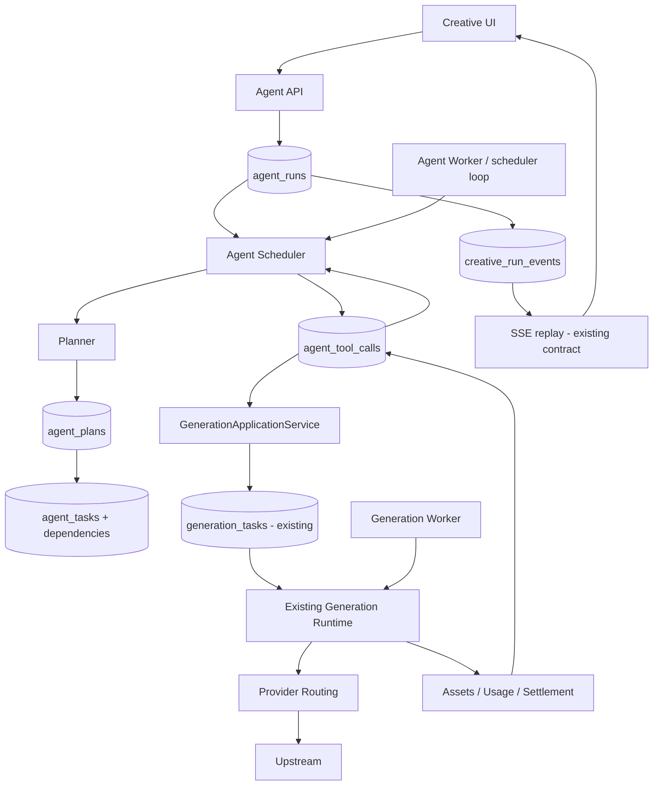

# AGENT_STABILITY_REFACTOR_PLAN

> Mục tiêu: refactor Agent để đạt durable execution, giảm false terminal failures và loại bỏ duplicate side effects/cost mà **không rewrite Generation Runtime đang hoạt động**.

## 1. Target architecture



### Ownership boundaries

**Agent Runtime owns:**

- intent/plan lifecycle;
- DAG dependencies;
- AgentTask state;
- ToolCall side-effect identity;
- partial retry/revision;
- aggregate run result.

**Generation Runtime owns:**

- admission;
- generation task persistence;
- provider attempt/failover;
- polling/webhook;
- generation result finalization;
- asset import;
- generation usage/settlement.

**Billing owns:**

- hold;
- attempt usage;
- settle/release;
- reconciliation;
- idempotency.

Agent không trực tiếp debit wallet và không gọi provider.

---

## 2. Non-goals của đợt refactor

Không làm đồng thời các feature sau trước khi stability đạt chuẩn:

- multi-agent swarm;
- autonomous infinite loop;
- Skill marketplace;
- vector long-term memory;
- Subject/IP Lock nâng cao;
- automatic creative self-iteration nhiều vòng;
- đổi toàn bộ provider routing;
- rewrite wallet/billing engine.

---

## 3. Implementation phases

## R0 — Baseline & reproducibility

**Mục tiêu:** khóa behavior hiện tại trước khi sửa.

### Tasks

- Tạo regression tests cho AGF-001/002/003/005/009/011.
- Ghi baseline success/failure metrics.
- Tạo fixture Agent Run 4-scene image→video.
- Tạo test direct generation và Agent generation dùng cùng binding.
- Tạo crash points có thể inject trong integration test.

### Files dự kiến

- `web/src/lib/server/agent-run-executor.test.ts`
- `web/src/lib/server/agent-run-execution-*.test.ts`
- `web/src/app/api/image-tasks/image-task-openai-live.test.ts`
- `web/src/lib/server/generation-task-recovery-service.test.ts`
- test mới dưới `web/src/lib/server/agent-stability/` nếu cần.

### Exit criteria

- Có test đỏ tái hiện từng P0 hiện tại.
- Không sửa behavior production trong R0.

---

## R1 — P0 hotfixes, không đổi data model

### R1.1 Fix image `/responses`

- `buildResponsesImageBodies()` không tạo image fallback thiếu `image_generation`.
- Tests xác nhận `/responses` image luôn classify image.

### R1.2 Planner settlement recovery

- retryable settlement không terminal hóa Run ngay;
- persist pending/failed-retryable finalization;
- schedule Agent recovery;
- permanent error mới fail.

Có thể dùng transitional representation trong current JSON trước khi schema mới hoàn tất.

### R1.3 Stop batch fail-fast

- short-term: `allSettled` + classify result;
- transient dispatch giữ task recoverable;
- không outer-throw toàn batch nếu chưa permanent.

### R1.4 Deployment version fencing

Heartbeat thêm metadata:

```text
buildVersion
gitSha
schemaVersion
runtimeProtocolVersion
```

Readiness fail nếu worker/app incompatible.

### Exit criteria

- P0 regression tests xanh.
- Không duplicate generation/charge trong injected retry tests.
- Existing direct generation tests không regression.

---

## R2 — Extract `GenerationApplicationService`

**Mục tiêu:** đưa business create/query/cancel generation ra khỏi Next route transport.

### API đề xuất

```ts
createGenerationTask(input, context): Promise<GenerationTaskRef>
getGenerationTask(id, context): Promise<GenerationTaskState>
cancelGenerationTask(id, context): Promise<CancelResult>
```

### Rules

- API route trở thành thin controller.
- Agent Tool gọi service trực tiếp.
- Auth/user ownership context phải explicit.
- Billing/admission vẫn chạy ở service/domain đúng boundary.

### Migration strategy

1. Extract image service trước.
2. video.
3. audio.
4. text.
5. cancel/query.

### Exit criteria

- REST path và internal path dùng chung tests/logic.
- Agent image/video không cần self-HTTP để create/query.

---

## R3 — Remove Agent self-HTTP

Thay trong:

- `agent-run-execution.ts`
- cancellation route/service

Từ:

```text
fetchInternalApi(/api/*-tasks)
```

sang:

```text
GenerationApplicationService
```

### Exit criteria

- không còn self-HTTP cho create/query/cancel child generation trong Agent runtime;
- HTTP transport failure không còn là `task_dispatch` class.

---

## R4 — Introduce Agent persistence model V2

### Tables

#### `agent_runs`

```text
id PK
user_id
conversation_id
project_id
surface
status
active_plan_version
failure_code
created_at
updated_at
started_at
completed_at
```

#### `agent_plans`

```text
id PK
run_id FK
version
goal
strategy
plan_json
created_at
UNIQUE(run_id, version)
```

Plan published là immutable.

#### `agent_tasks`

```text
id PK
run_id FK
plan_id FK
task_key
type
status
input_json
output_json
error_json
attempt_count
lease_owner
lease_until
next_attempt_at
created_at
started_at
completed_at
UNIQUE(plan_id, task_key)
```

#### `agent_task_dependencies`

```text
task_id FK
depends_on_task_id FK
PRIMARY KEY(task_id, depends_on_task_id)
```

#### `agent_tool_calls`

```text
id PK
task_id FK
tool_name
idempotency_key UNIQUE
status
accepted_at
generation_task_id
input_json
output_json
error_json
created_at
updated_at
```

### Event strategy

Tiếp tục dùng `creative_run_events` trong V2 để giữ SSE contract. Có thể bổ sung unique/source fields sau nếu cần, nhưng không cần tạo event system khác ở phase này.

### Migration strategy

- feature flag `AGENT_RUNTIME_V2`;
- old runtime vẫn hoạt động;
- không backfill toàn lịch sử nếu không có business need;
- có thể dual-write tối thiểu trong canary nếu cần so sánh.

---

## R5 — Durable Agent Scheduler

### AgentRun state target

```text
CREATED
PLANNING
PLANNED
EXECUTING
WAITING_USER
COMPLETED
FAILED
CANCELLING
CANCELLED
```

### AgentTask state target

```text
PENDING
READY
CLAIMED
RUNNING
WAITING_RETRY
WAITING_CHILD
FINALIZING
COMPLETED
FAILED
SKIPPED
CANCELLED
```

### Claim semantics

Reuse pattern đã tốt từ Generation Scheduler:

```sql
FOR UPDATE SKIP LOCKED
```

với lease.

### Dependency rule

Task -> READY chỉ khi tất cả required dependencies `COMPLETED` hoặc dependency policy cho phép partial.

### Failure rule

- retryable -> WAITING_RETRY;
- unknown side-effect outcome -> reconciliation path;
- permanent branch error -> FAILED;
- parent fail/partial-complete theo deliverable policy, không theo exception propagation.

---

## R6 — Tool Registry + ToolCall boundary

### V1 tools

```text
generate_text
generate_image
generate_video
generate_audio
get_asset
```

Tool name phải capability-oriented, không provider-oriented.

Sai:

```text
generate_dflop_seedance
```

Đúng:

```text
generate_video
```

### ToolCall rule

Trước side effect:

1. create/get ToolCall bằng deterministic idempotency key;
2. nếu đã có `generation_task_id`, reuse;
3. nếu trạng thái unknown, reconcile;
4. chỉ create generation khi chứng minh chưa có prior side effect.

---

## R7 — Accepted-boundary and idempotency hardening

### Accepted boundary

Một call được coi đã accepted khi có bằng chứng như:

- generation task persisted locally và request binding fixed;
- upstream task ID returned;
- provider acceptance explicitly recorded;
- first upstream content nhận được với synchronous generation.

Sau accepted:

- không blind resubmit;
- không blind provider failover;
- recovery query/reconcile trước.

### Keys

```text
AgentToolCall idempotency key
Generation client_request_id
Billing businessRequestId
Provider idempotency key (nếu supported)
```

Các key phải có mapping deterministic, không random mỗi retry.

---

## R8 — Billing/reconciliation boundary

### Planner billing

Tách state:

```text
PENDING
SETTLING
SETTLED
RETRY_WAIT
FAILED_PERMANENT
```

Retryable settlement không fail run.

### Generation billing

Không đưa vào Agent state machine ngoài reference/summary. Generation runtime tiếp tục sở hữu usage settlement.

### Reconciliation jobs

- orphan hold recovery;
- settled ledger but stale Agent state;
- completed generation but missing Agent ToolCall finalization.

### Exit criteria

Crash ở mọi điểm trước/sau settlement không debit hai lần.

---

## R9 — Provider protocol normalization

### Binding config

Mỗi binding khai báo protocol rõ:

```text
OPENAI_CHAT
OPENAI_RESPONSES
OPENAI_IMAGES_JSON
OPENAI_IMAGES_MULTIPART
OPENAI_RESPONSES_IMAGE
OPENAI_VIDEO_ASYNC
GEMINI_GENERATE_CONTENT
GEMINI_LONG_RUNNING
CUSTOM
```

### Adapter contract

```text
normalize request
submit
classify acceptance
extract upstream task ID
poll/query
cancel
parse result
classify error
```

### Error taxonomy

```text
INVALID_REQUEST
AUTH
RATE_LIMIT
PROVIDER_5XX
NETWORK_BEFORE_ACCEPT
UNKNOWN_AFTER_SEND
ACCEPTED_ASYNC
READ_ERROR_AFTER_ACCEPT
TIMEOUT
UNSUPPORTED_PROTOCOL
```

Runtime fallback chỉ dựa vào taxonomy, không dựa vào "thử payload khác cho tới khi chạy".

---

## R10 — Event/SSE integration V2

**Không rewrite SSE protocol.** Reuse:

- `creative_run_events`;
- `Last-Event-ID`;
- snapshot resync;
- heartbeat.

V2 scheduler emit các event:

```text
run.created
run.planning
run.planned
run.executing
run.waiting_user
run.completed
run.failed

task.ready
task.claimed
task.running
task.retry_waiting
task.completed
task.failed

tool.created
tool.submitting
tool.accepted
tool.completed
tool.failed

asset.created
```

Event là projection/notification; DB entity state vẫn là source of truth.

---

## R11 — Planner cleanup

Planner chỉ chịu trách nhiệm:

```text
user intent
→ structured plan
```

Planner không biết:

- URL nội bộ;
- provider;
- wallet;
- retry implementation;
- worker lease;
- HTTP transport;
- settlement sequence.

### Plan schema cần stable task key

Ví dụ:

```text
scene.1.image
scene.1.video
scene.2.image
scene.2.video
```

Dùng cho revision/reuse.

---

## R12 — Review out of critical path

Default:

```text
required tasks complete
→ run completed
→ schedule background review
```

Blocking review chỉ khi:

- strict review requested;
- regulated/quality-gated workflow;
- explicit "high quality" mode.

---

## R13 — Admin observability & operational controls

Admin tree:

```text
AgentRun
 ├─ Plan v2
 ├─ Task scene.1.image
 │   └─ ToolCall
 │       └─ GenerationTask
 │           └─ ProviderAttempt
 └─ Task scene.1.video
```

Fields bắt buộc hiển thị:

- timestamps;
- retry count;
- accepted boundary;
- provider/upstream ID;
- hold/settlement status;
- asset output;
- failure code;
- recovery action.

Operational actions:

- retry safe task;
- reconcile unknown ToolCall;
- cancel run;
- reschedule stuck task;
- inspect but không cho manual double-settle.

---

## R14 — Chaos & recovery test suite

Các crash point bắt buộc:

1. trước ToolCall persist;
2. sau ToolCall persist, trước generation create;
3. sau local generation create, trước provider submit;
4. ngay sau provider accepted;
5. sau provider complete, trước asset persist;
6. sau asset persist, trước ToolCall complete;
7. trước settlement;
8. sau settlement, trước state update;
9. worker lease expiry;
10. concurrent worker claim;
11. app restart;
12. worker restart;
13. SSE disconnect/reconnect.

Mỗi test phải assert cả:

```text
business result
number of provider submissions
number of assets
number of usage records
wallet delta
hold state
event sequence
```

---

## R15 — Canary rollout

### Feature flags

```text
AGENT_RUNTIME_V2=false
AGENT_TOOL_SERVICE_V2=false
AGENT_PROVIDER_PROTOCOL_STRICT=false
```

### Rollout

1. local/integration only;
2. admin accounts;
3. internal users;
4. 1–5% canary;
5. 25%;
6. 100%;
7. remove legacy executor sau soak period.

### Automatic rollback triggers

- duplicate settlement detected;
- duplicate upstream submission rate > threshold;
- Agent success rate giảm đáng kể so baseline;
- stuck active runs > threshold;
- worker version mismatch;
- reconciliation backlog tăng liên tục.

---

## 4. Dependency order

```text
R0
 ↓
R1
 ↓
R2 → R3
 ↓
R4
 ↓
R5
 ↓
R6
 ↓
R7
 ↓
R8
 ↓
R9
 ↓
R10
 ↓
R11
 ↓
R12
 ↓
R13
 ↓
R14
 ↓
R15
```

Không nên bắt đầu R11 Planner redesign trước khi R5–R8 ổn định; nếu không sẽ tiếp tục thay prompt/model để chữa lỗi runtime.

---

## 5. File/module mapping

| Current module | Refactor direction |
|---|---|
| `agent-run-executor.ts` | planning entry + legacy adapter, giảm responsibility |
| `agent-run-execution.ts` | thay dần bằng durable Agent scheduler + tools |
| `agent-run-store.ts` | legacy read adapter; new repositories cho agent_* |
| `creative-runtime-repository.ts` | giữ conversations/events; bỏ whole-run task graph write ở V2 |
| `generation-task-scheduler.ts` | reuse patterns, không trộn AgentTask row vào generation lifecycle lâu dài |
| `generation-task-recovery-service.ts` | giữ generation recovery; V2 Agent recovery tách service |
| `system-ai-billing.ts` | reuse idempotency/fingerprint primitives |
| `image-task-openai.ts` | protocol-specific adapter strict |
| `system-ai-proxy-policy.ts` | capability authority rõ ràng |
| `/api/*-tasks` | thin controller trên GenerationApplicationService |
| `creative_run_events` | reuse event contract/SSE replay |
| `generation-worker.mjs` | giữ; thêm version fencing và metrics |

---

## 6. Acceptance criteria cuối cùng

Agent được coi là ổn định khi tất cả điều sau đúng:

- app restart giữa run -> run tiếp tục;
- worker restart -> run tiếp tục;
- browser refresh/disconnect -> execution không đổi;
- provider accepted rồi crash -> không submit duplicate;
- billing settled rồi crash -> không charge duplicate;
- một branch transient fail -> sibling giữ nguyên và branch retry;
- permanent branch fail -> parent result theo policy, không mất outputs thành công;
- retry không duplicate asset;
- planner settlement transient -> auto recover;
- direct generation và Agent Tool dùng cùng Generation Application Service;
- app/worker incompatible -> readiness chặn trước khi nhận production jobs;
- mọi terminal run truy được đến exact task/tool/generation/provider/billing failure;
- chaos suite xanh liên tục.

---

## 7. Recommended first implementation batch

Batch đầu chỉ nên gồm:

```text
R0 baseline tests
+
R1.1 image /responses fix
R1.2 planner settlement recovery
R1.3 batch fail-fast fix
R1.4 worker/app version fencing
```

Không trộn schema V2 vào cùng PR đầu tiên. Sau khi P0 behavior ổn định và regression suite xanh mới bắt đầu `GenerationApplicationService` và Agent persistence V2.
